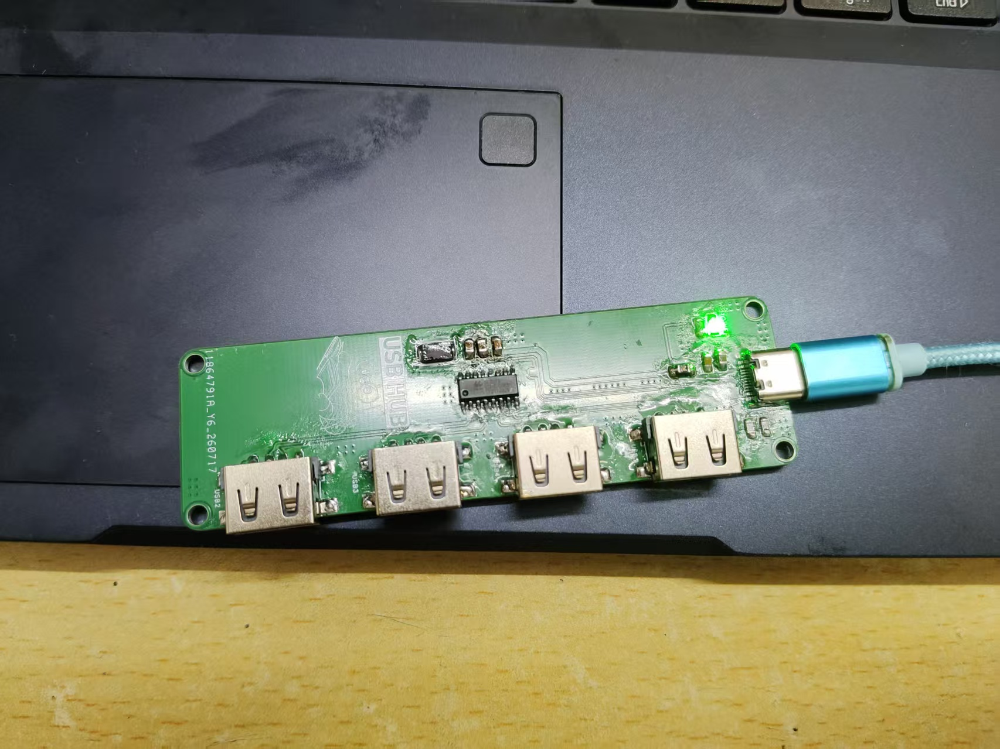
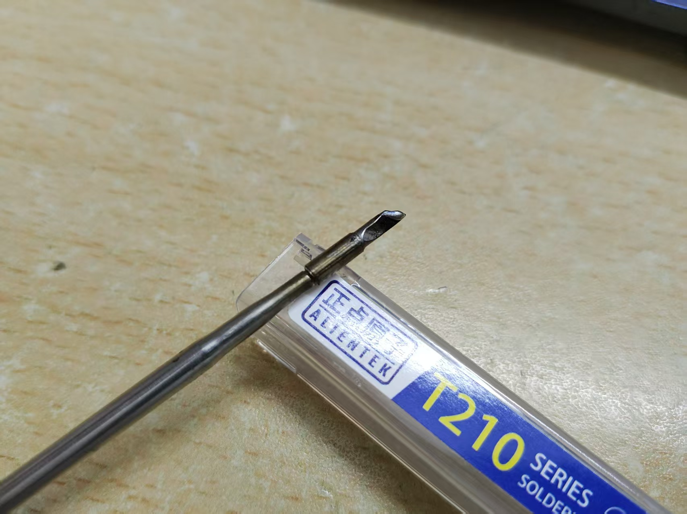
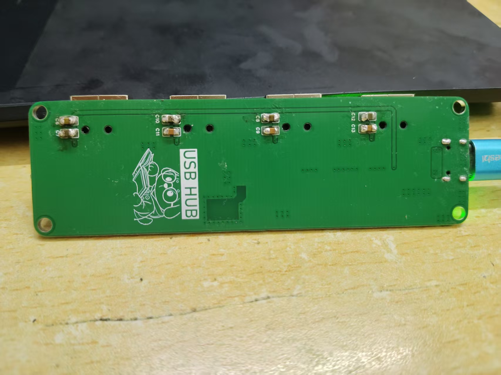

# 2026-08-15｜手搓一个 USB 拓展坞：从画板到点亮，我踩过的那些坑

> 一块 Type-C 转 4×USB-A 的 USB 2.0 HUB 拓展坞，从设计选型、PCB Layout、打样、焊接，到调试修复的全过程记录。

## 起因

一直想自己完整走一遍"电子产品的诞生流程"——不是抄板，而是从零开始：选芯片、画原理图、布板、下单打样、拿到手焊接、最后把它点亮。于是就有了这块 USB 拓展坞。

## 设计选型

| 部分 | 选型 | 理由 |
|---|---|---|
| 主控 | **SL2.1A**（和芯润德 CoreChips） | USB 2.0 高速 4 口 HUB 控制器，SOP-16，内置 5V→3.3V→1.8V 稳压和复位电路，还支持 BC1.2 充电协议。关键是便宜（¥0.8 左右） |
| 上行口 | Type-C 16P 母座 | 跟上时代，电脑手机都能接 |
| 下行口 | 4×USB-A 母座 | 最通用的外设接口 |
| 保护 | 1.5A 快恢复保险丝 | 总线供电，过流保护不能少 |
| 时钟 | 12MHz 贴片晶振 | SL2.1A 需要 |
| 指示 | 绿色 LED + 2kΩ 限流 | 电源指示 |

Layout 用的是嘉立创 EDA 专业版（跟着国一学长的保姆级教程学的），双面板，元件基本都在正面。打样走嘉立创，一周到手。

## 焊接

工具：锐能特 T210 焊台 + 小刀头 + 助焊剂。

最大的挑战是 SOP-16 主控——引脚间距只有 1.27mm，全靠小刀头拖焊 + 吸锡带清理。Type-C 16P 母座焊盘密，焊完要反复检查有没有连锡。第一次上手焊这种密脚芯片，全程屏住呼吸。

焊完通电，LED 亮了——第一关过了。

## 调试：这一天最刺激的部分

**症状：LED 常亮，但电脑完全识别不到设备。**

排查过程（感谢 AI 助手 DeepSeek-V4-Flash 全程协助远程诊断）：

1. **看系统日志**：设备管理器、PnP 事件日志里啥都没有——主机根本没检测到设备插入
2. **测芯片供电**：VDD5 = 5.19V ✅、VDD33 = 3.43V ✅、VDD18 = 2.06V ⚠️ —— 芯片有电
3. **测 DP 上行引脚**：量到 2.58V —— 芯片的 USB 上拉电阻生效了，**芯片是活的**，但主机就是不认
4. **设备管理器出现"未知 USB 设备（设备描述符请求失败）"错误码 43** —— 主机检测到了设备，但设备不响应握手

到这里基本锁定了：**芯片有电但没在"跑"** —— 没有时钟。SL2.1A 是 12MHz 晶振起振后才有 USB 引擎的，芯片醒不过来，最可能的原因就是**晶振没起振**。

然后就是经典的"虚焊"问题：用万用表量晶振两脚偏置电压 1.42V / 0.83V（偏置在），但万用表量不出振荡。于是**重焊 X1 晶振**——

重新插上 Type-C，设备管理器里出现了「**通用 USB 集线器**」，错误码 43 消失。🎉 **枚举成功了！**

## 后面的小插曲

- **插 U 盘就掉线**：换了根数据线解决（线材接触不良）
- **U 盘（大白菜 PE 盘）插上 HUB 复位**：这是 USB 3.0 存储设备与 SL2.1A（USB 2.0 芯片）的兼容性问题，不是板子故障——鼠标键盘插上去完全正常
- **手机插上只充电、不弹 MTP 文件传输**：SL2.1A 这类入门芯片对 Android 手机 MTP 枚举的兼容性确实一般，属芯片固有限制

最终验证：两个鼠标同时通过 HUB 正常工作，板子完工。

## 一些感悟

设计一个电子实物产品，真的非常需要实操经验：

- **课本不会告诉你**：贴片晶振会虚焊，虚焊会让芯片"有电没魂"
- **万用表能救你**：测供电、测上拉、测通断、测短路——一台万用表撑起整个调试
- **排除法永远好用**：设备直连（排除设备）→ 换线（排除线）→ 换口（排除口）→ 最后才怀疑板子
- **错误码 43 是个好线索**：它意味着"芯片活跃但不响应"，基本指向时钟问题

第一次完整走完"设计 → Layout → 打样 → 焊接 → 调试"的闭环，成就感拉满。下一块板子已经在构思了。

感谢国一学长的嘉立创 EDA 教程，感谢 AI 助手 DeepSeek-V4-Flash 的全程远程协助，感谢我自己没在晶振上放弃（笑）。

---
*PandaGuGu · 2026-08-15*